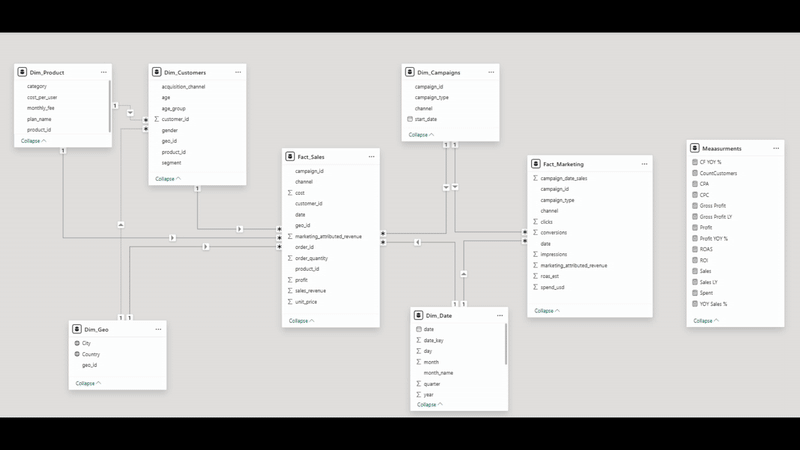

Designed and implemented an end-to-end interactive BI dashboard to track and analyze sales and marketing performance by region, campaign, and customer segment, highlighting top-performing categories and most effective marketing efforts.  
Optimized data model relationships Star Schema and DAX calculations for KPIs, YoY Growth, MoM Trends, Profit Margin, Customer Acquisition Cost (CAC), Click-Through Rate (CTR), and Return on Investment (ROI) to enhance performance and maintain analytical accuracy.

